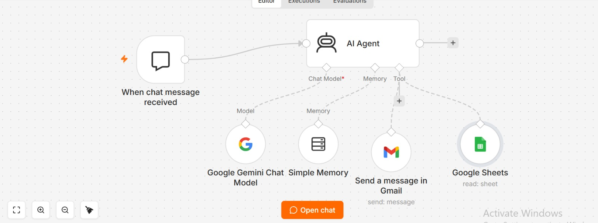

# AI Data Analyst — n8n

AI-powered sales data analysis and automated reporting using **n8n, Google Gemini, Google Sheets, and Gmail**.

## 🚀 Project Overview

This project is an AI-powered Data Analyst Agent built with n8n.

Users can ask questions about sales data using natural language. The AI Agent retrieves the relevant data from Google Sheets, analyzes it using Google Gemini, and returns the results in a conversational format.

The agent can also send the analysis to a configured email address when the user explicitly asks for an email report.

## ✨ Features

- 🤖 Natural-language sales data analysis
- 📊 Google Sheets data integration
- 🧠 Google Gemini AI-powered analysis
- 💬 Conversational interaction with memory
- 📧 Automated Gmail reporting
- 🔄 n8n workflow automation
- 📈 Sales performance analysis

## 🏗️ Workflow Architecture

```text
User
  ↓
When Chat Message Received
  ↓
AI Agent
  ├── Google Gemini Chat Model
  ├── Simple Memory
  ├── Google Sheets Tool
  └── Gmail Tool
  ↓
AI-generated Analysis


## 🔄 Workflow




  ↓
User
